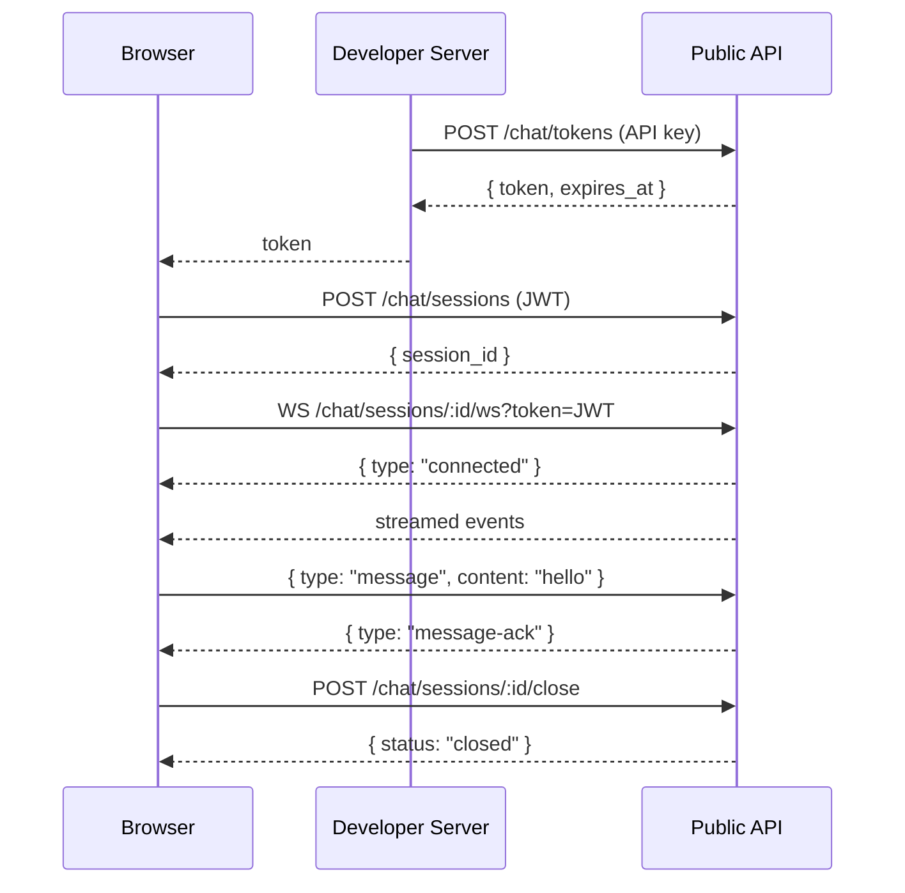

# HappyRobot Chatbot SDK Example

A minimal example showing how to build a custom chat UI using the `@happyrobot-ai/sdk`. It includes a **server** (Express) that securely creates chat tokens and a **client** (React + Vite) that connects via WebSocket for real-time messaging.

## Architecture



The SDK uses a **two-tier auth model**:

1. **Your server** creates a scoped client token using the API key (keeps the key secret).
2. **The browser** uses `HappyRobotChatClient` with that short-lived token for all chat operations.

## Project Structure

```
├── server/          Express server — creates chat tokens
│   └── src/index.ts
├── client/          React app — chat UI
│   └── src/App.tsx
└── README.md
```

## Prerequisites

- Node.js 18+
- A HappyRobot API key and a workflow ID with a chat-enabled agent

## Quick Start

### 1. Install dependencies

```bash
cd server && npm install
cd ../client && npm install
```

### 2. Configure environment

Create `server/.env`:

```
HAPPYROBOT_API_KEY=sk_live_...
WORKFLOW_ID=your-workflow-id
```

### 3. Run

In two terminals:

```bash
# Terminal 1 — server (port 3001)
cd server && npm run dev

# Terminal 2 — client (port 5173)
cd client && npm run dev
```

Open [http://localhost:5173](http://localhost:5173) and click **Start Chat**.

---

## How It Works

### Server — Token endpoint

The server exposes a single endpoint that exchanges your secret API key for a short-lived client token:

```ts
import { HappyRobotClient } from "@happyrobot-ai/sdk";

const client = new HappyRobotClient({ apiKey: process.env.HAPPYROBOT_API_KEY });

app.post("/api/chat/token", async (_req, res) => {
  const { token, expires_at } = await client.chat.createToken({
    workflow_id: WORKFLOW_ID,
  });
  res.json({ token, expires_at });
});
```

> The browser never sees the API key — only the scoped, time-limited token.

### Client — Chat lifecycle

The browser-side code follows this flow:

```ts
import { HappyRobotChatClient } from "@happyrobot-ai/sdk/chat";

// 1. Get a client token from your server
const { token } = await fetch("/api/chat-token", { method: "POST" }).then(r => r.json());

// 2. Initialize the browser-side client
const chat = new HappyRobotChatClient({ token });

// 3. Create a session
const { session_id } = await chat.createSession();

// 4. Connect via WebSocket and handle events
const connection = chat.connect(session_id, {
  onResponseStart:  ()        => { /* show typing indicator */ },
  onResponseChunk:  (content) => { /* append streamed text */ },
  onResponseEnd:    (content) => { /* full response ready */ },
  onSessionClosed:  (event)   => { /* session ended */ },
  onTokenExpired:   ()        => { /* refresh token & reconnect */ },
});

// 5. Send messages
await connection.sendMessage({ content: "Hello!" });

// 6. Clean up
connection.close();
```

### File Uploads

The SDK supports sending files alongside messages:

```ts
// Upload a file (convenience method — handles presigned URL + PUT + completion)
const artifact = await chat.uploadFile(fileBlob, "photo.png", "image/png");

// Attach it to a message
await connection.sendMessage({
  content: "Here's the photo",
  artifacts: [artifact],
});
```

---

## SDK Reference

Full SDK documentation: [`@happyrobot-ai/sdk` on npm](https://www.npmjs.com/package/@happyrobot-ai/sdk)

### `HappyRobotClient` (server-side)

| Method | Description |
|---|---|
| `client.chat.createToken({ workflow_id, env? })` | Create a scoped client token (1 hour expiry) |

### `HappyRobotChatClient` (browser-side)

| Method | Description |
|---|---|
| `chat.createSession()` | Create a new chat session |
| `chat.connect(sessionId, handlers)` | Open bidirectional WebSocket — returns `ChatConnection` |
| `chat.sendMessage(sessionId, { content, artifacts? })` | Send a user message via HTTP (fallback if WS unavailable) |
| `chat.getHistory(sessionId)` | Get message history |
| `chat.uploadFile(file, filename, mimeType)` | Upload a file (convenience method) |
| `chat.getPresignedUpload({ filename, mime_type })` | Get presigned S3 upload URL |
| `chat.completeUpload({ artifact_id, s3_uri, ... })` | Register uploaded artifact |

### `ChatConnection`

| Method | Description |
|---|---|
| `connection.sendMessage({ content, artifacts? })` | Send a message via WebSocket. Returns a `Promise` that resolves with the server ack |
| `connection.close()` | Close the WebSocket connection |
| `connection.ws` | The underlying `WebSocket` instance |

### WebSocket Events

**Server -> Client:**

| Event | Fields | Description |
|---|---|---|
| `connected` | `session_id` | Connection established |
| `response-start` | `content` | AI started generating a response |
| `response-chunk` | `content` | Partial response text |
| `response-end` | `content` | Complete response text |
| `session-closed` | `session_id`, `status`, `reason`, `duration`, `timestamp` | Session ended |
| `token-expired` | — | JWT expired — reconnect with a fresh token |
| `message-ack` | `id`, `message` | Server confirmed the message was sent |
| `message-error` | `id`, `error` | Server failed to send the message |
| `heartbeat` | — | Keep-alive (every 15 s) |

**Client -> Server:**

| Event | Fields | Description |
|---|---|---|
| `message` | `content`, `artifacts?`, `id?` | Send a user message. `id` is echoed back in ack/error |

---

## Error Handling

```ts
import { ApiError, AuthenticationError, NotFoundError } from "@happyrobot-ai/sdk";

try {
  await client.chat.createToken({ workflow_id: "bad-id" });
} catch (err) {
  if (err instanceof NotFoundError)        console.log("Workflow not found");
  else if (err instanceof AuthenticationError) console.log("Invalid API key");
  else if (err instanceof ApiError)        console.log(err.status, err.message);
}
```
